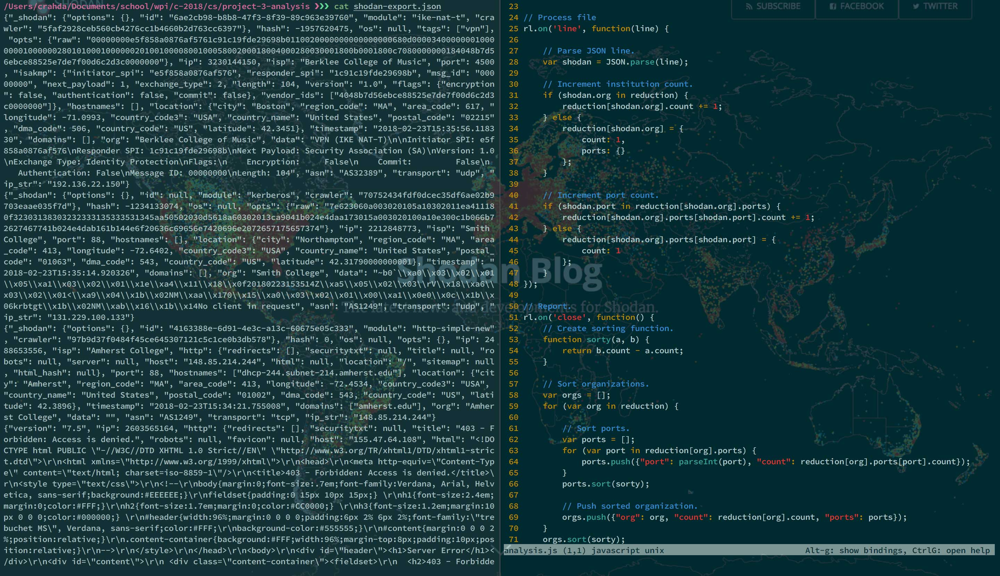
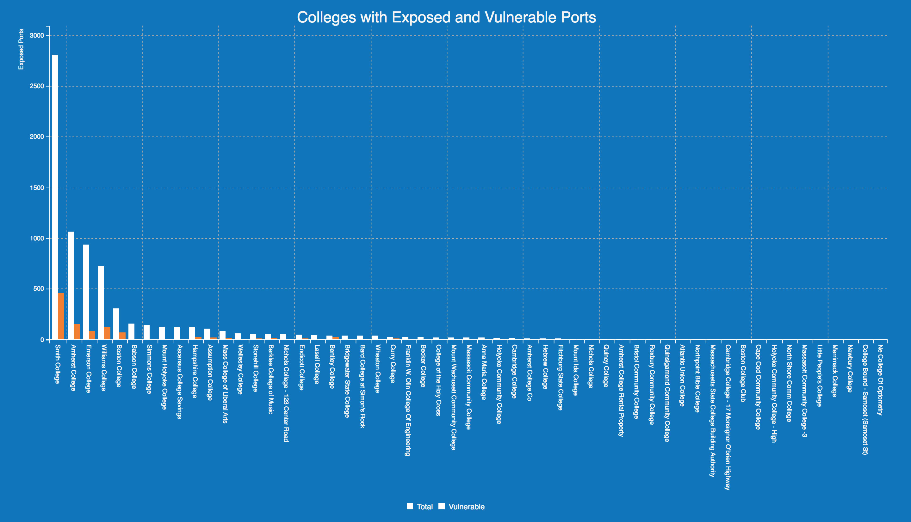
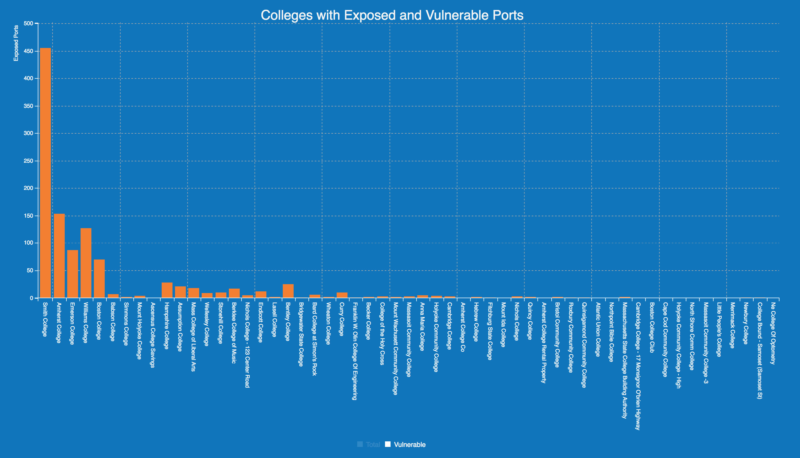

## 1. Introduction and Hypothesis
> ***Note:*** This paper is based on our originally submitted proposal for Project 3, and reuses the verbiage from that document.

In this paper, we hope to answer a single question: Are liberal arts colleges, which grow thought-leaders and philosophers, doing as much work as technical and engineering colleges in order to protect their institutional networks? 

Our initial hypothesis is that liberal arts colleges are not adequately protecting their institutional networks, since they are generally less technoloy-oriented and thus have less of a focus on protecting their networks.

## 2. Methodology and Assumptions
To prove our hypothesis, we will analyze the following data:

1. The most frequently attacked (e.g., ***vulnerable***) network ports.
2. The colleges that have ***any*** publicly-discoverable network ports.
3. The colleges that have any ***vulnerable*** ports.
4. The proportion of these colleges that are strongly affiliated with the Liberal Arts.

We will limit our search to only the colleges in the state of Massachussetts in order to fit within the constraints of this study. For the top ten colleges (e.g., the colleges with the most publicly discoverable ports), we will determine if they are strongly affiliated with the Liberal Arts based on their website and, if needed, matriculation data from the National Center for Education and Statistics (https://nces.ed.gov/collegenavigator/).

## 2.1 Vulnerability Criteria
We utilized Norse Corp's cyber attack thread map (http://map.norsecorp.com) to determine the most vulnerable network ports. After running their web application for several minutes, the following ports rose to the top of the attack list:

- 25 (SMTP)
- 23 (Telnet)
- 5900 (VNC)
- 8080 (HTTP)
- 445 (MS Active Directory)
- 3389 (MS Terminal Server)
- 50864 (XSAN FS?)
- 123 (Network Time Protocol)
- 53413 (XSAN FS?)
- 1433 (MS SQL)

In addiiton to these ports, we also included Port 22, which is used for the Secure Shell (SSH) protocol, and is commonly attacked by bad actors world-wide.

### 2.2 Vulnerability Data and Analysis
We used Shodan (https://www.shodan.io), an Internet of Things search engine, to obtain a list of publicly-discoverable web services belonging to all college-like organizations in the state of Massachussetts.

The raw JSON-formatted results of our Shodan search were too large for manual processing, so we developed a Node.js script to perform a map-reduction operation on the results to convert them to a parseable format (Fig. 1). We then utilized C3 (a wrapper library for the D3, https://d3js.org/) to graph these results for analysis (Fig. 2, Fig. 3).

## 3. Results

The top ten universities that appeared in our results (Fig. 2) identified themselves as liberal arts colleges, including:

- Smith
- Amherst
- Emerson
- Williams
- Boston
- Babson
- Simmons
- Mount Holyoke
- Hampshire
- Mass College of Liberal Arts
- Wellesley

Of these top ten universities, nine of them had one or more vulnerable ports (Fig. 3). Overall, 100% of the colleges identified in our results were affiliated with the liberal arts, and 90% of them had at least one publicly discoverable vulnerable port. 

## 4. Discussion
These results support our hypothesis, demonstrating that liberal arts colleges in Massachusetts are more vulnerable to network attacks than non-liberal arts colleges. This may be because they do not focus on securing their network infrastructure or that they simply do not know that the ports that they are using are vulnerable. 

### 4.1 Social Implications
We hypothesize that because liberal arts universities are less secure than technical schools, their students (by extension) will misunderstand or fear technology, while technical students will learn about and exploit technology.

Students of the liberal arts could come to view technology as untrustworthy. If their school network is hacked, they could question the safety of technology. If their school - which they pay thousands of dollars to attend - can't secure its infrastructure, can anyone secure any infrastructure? Taking it a step further, the professors at these universities could adopt these fears and teach their students to shy away from technology.

On the reverse side, students at technical universities will learn that technology is a tool to leverage. They will come to trust it, and so will their professors (presumably). Over time, these students will learn the limitiations and capabilities of technology, and they will learn to avoid situations where technology could fail or be useless, mastering technology instead of fearing it.

We believe this educational split could have a deep and profound impact: our already politically polarized country will become *technologically* polarized. On one side, there will be those who can leverage technology to accomplish their tasks, and on the other there will be those who demonize technology as something that is dangerous and invasive.

### 4.2 Future Work
To gain a deeper understanding of this problem in the future, we could extend our investigation to reach out to the IT departments of these colleges and ask them if they know if there ports are exposed and vulnerable. We could also extend this experiment beyond Massachusetts to see if this is truly a problem for colleges across the country, gather data on which vulnerable ports are most common nationwide, and survey students to see if there is a correlation between their IT infrastructure and their attitudes about technology.

## 4. Sources Cited
This paper, the associated presentation, and all analysis scripts and data are publicly available on Git Hub (https://github.com/Mizumi/college-vulnerability-analysis). In addition, the presentation (http://quirky-murdock-e9a5b2.netlify.com/presentation) and D3 graphs (http://quirky-murdock-e9a5b2.netlify.com) may be viewed directly online.

- https://www.shodan.io

- https://www.shodan.io/report/EPJF2Sy8
    
- http://map.norsecorp.com

- https://www.csoonline.com/article/3217944/security/8-top-cyber-attack-maps-and-how-to-use-them.html

- https://nces.ed.gov/collegenavigator/

